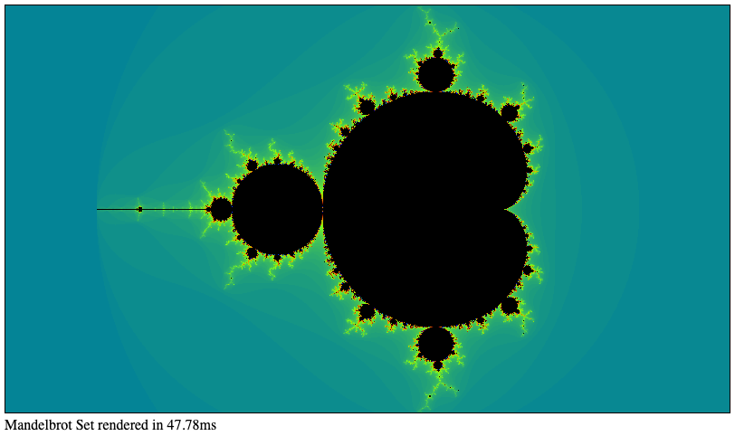

| Previous | | Next
|---|---|---
| [3: Basic WAT Implementation](../../03%20WAT%20Basic%20Implementation/) | [Up](../../) | 
| [4.1 Check for Early Bailout](../01/) | [4: Optimised WAT Implementation](../) | 

### 4.2: Modify Render Loop

In our previous implementation of the WAT function `mandel_plot`, we simply looped around every pixel in the image:

1. Converting each pixel's location to the corresponding coordinates on the complex plane, then
1. Arbitrarily calling function `escape_time_mj`

Now, before calling function `escape_time_mj`, we must first check where the current pixel is located.  If it lies within either the main cardioid or the period 2 bub, we can skip calling `escape_time_mj`

The innermost `if` expression in function `mandel_plot` has now been extended to perform this additional test:

```wat
;; Store the current pixel's colour using the value returned from the following if expression
(i32.store
  (local.get $pixel_offset)
  (if (result i32)
    ;; Can we avoid running the escape-time algorithm?
    (call $early_bailout (local.get $x_coord) (local.get $y_coord))
    ;; Yup, so we know this pixel will be black
    (then (global.get $BLACK))
    ;; Nope, we can't bail out early
    (else
      (if (result i32)

        ;; Same coding as before

      )
    )
  )
)
```

Just by the addition of this simple test, we have shortened the render time by a factor of about 6!



Here's an implementation of the [optimised WAT coding](wat-optimised-implementation.html)