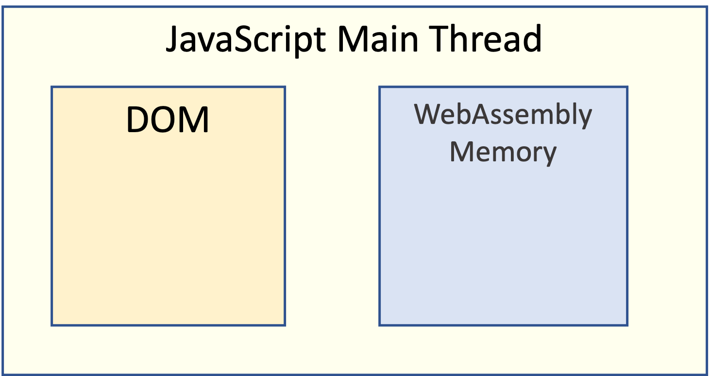
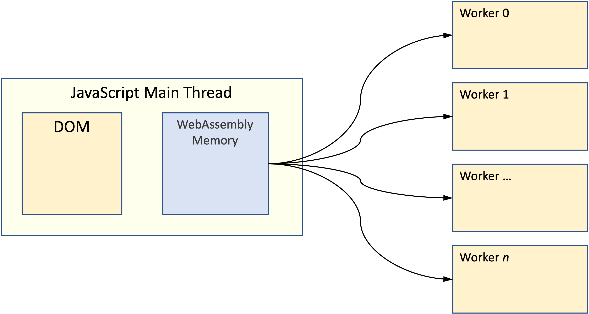
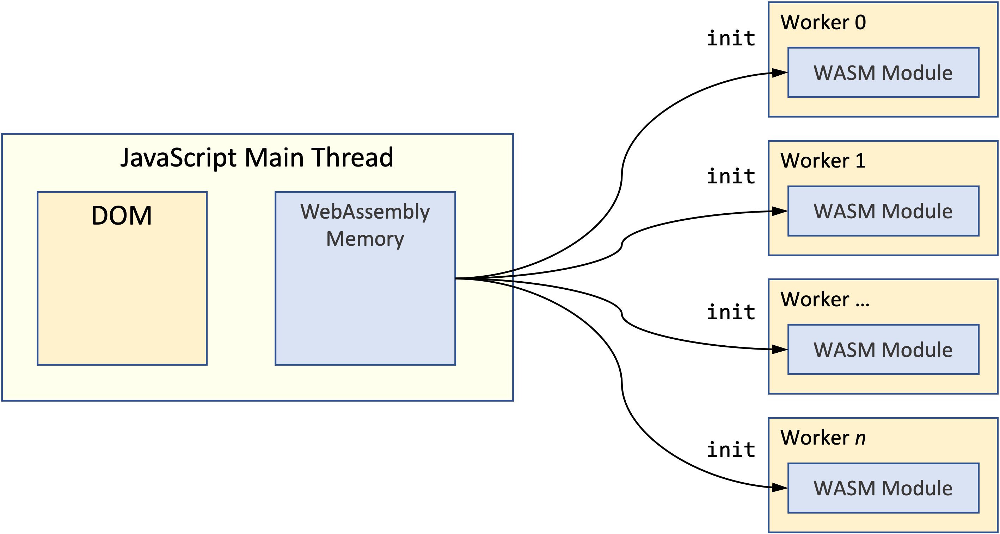
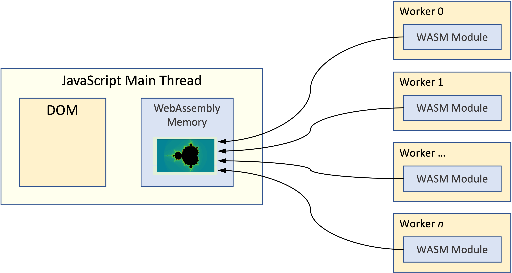
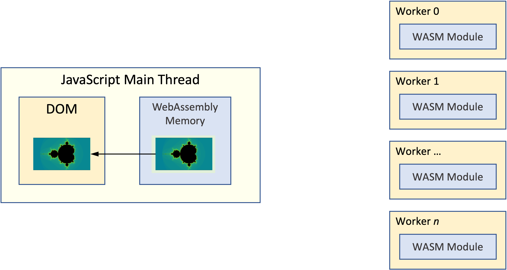

| Previous | | Next
|---|---|---
| [6: Zooming In](../../06%20Zoom%20Image/) | [Up](../../) | 
| [7.1 JavaScript Web Workes](../01/) | [7: WebAssembly and Web Workers](../) | [7.3 Create Web Worker](../03/) 

### 7.2: Schematic Overview

In order to understand the changes that are needed here, let's first lay out the overall architecture we need to implement.

#### Allocate WebAssembly Memory

The main thread needs to allocate the memory that will be shared by the multiple instances of our WebAssembly module

#### Generate Worker Threads

The main thread then creates as many Web Workers as are required for the particular task.  Each Web Worker is a different instance of the ***same*** JavaScript file.

Each Web Worker instance is passed a reference to the block of WebAssembly memory

#### Initialise Each Web Worker

In our case, the first thing we do after the Web Worker starts is to send it an initialisation message.  Upon receiving this message, the Web Worker creates its own instance of the WebAssembly module and, most importantly, passes that module a reference to the shared memory created by the main thread.

All WebAssembly modules now have access to the same block of memory

#### Plot the Image

Having created its own WebAssembly module instance, each Web Worker invokes the `mj_plot` function to create the initial image of the Mandelbrot Set.

The difference now is that the details of the current pixel being plotted are written to shared memory where they can be read by all the running instances of the `mj_plot` function.

The `mj_plot` function performs an atomic read-modify-write operation in which it reads the next pixel from memory, increments the value and then writes it back.[^1]  Whichever instance of `mj_plot` is ready to calculate the next pixel simply performs the same atomic read-modify-write operation on the current pixel value.

Now we can invoke as many instances of the `mj_plot` function as we like, knowing that they will never interfere with each other by attempting to plot the same pixel.

#### Update the UI from Shared Memory

Once all the instances of `mj_plot` have finished, the main thread then transfers the image data from WebAssembly shared memory into the `canvas` HTML element.

---
[^1]: All without the need for lock objects or mutexes!

